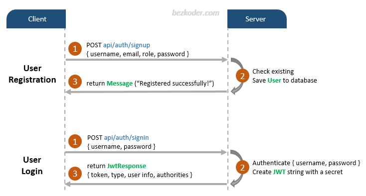

# Spring Security Documentation

Table of Contents
1. [Introduction](#Introduction:)
2. [Added URLs and Actions](#Added-URLs-and-Actions:)
3. [Authentication Flow](#Authentication-Flow:)
4. [Class Responsibilities](#Class-Responsibilities:)

### **Introduction:**
This web app's security is handled through the Spring Security dependency. It works by requiring the user to have a valid form of authorization to view the large majority of the web app. This program is a single page web app, so instead of having the authorization be added to a header upon login, interactions within the app are blocked without a valid authorization. Authoriization comes in the form of a [JWT](JWT.md) and is given to the user after logging in. Account information is stored in [MongoDB](MONGODB.md), which is linked to Spring Security through the app.

### **Added URLs and Actions:**
##### POST Methods
* /api/auth/signup
    * Accepts a JSON with username, email, password, and role(s)
    * If valid, adds the user to the database
        * Validation handled with the Validation API dependency
* /api/auth/signin
    * Accepts a JSON with username and password
    * If valid, grants the user a JWT

##### GET Methods
* /api/test/all
    * Tests if client has access to any general content
* /api/test/user
    * Tests if client has access to "user" clearance level content
* /api/test/mod
    * Tests if client has access to "moderator" clearance level content
* /api/test/admin
    * Tests if client has access to "admin" clearance level content

### **Authentication Flow:**

Credit: [Bezkoder](https://bezkoder.com/spring-boot-jwt-authentication/)

##### Summary
* Registration
    * When creating an account the app will POST to /api/auth/signup with a username, email, password, and role(s)
    * The app will verify that user does not already exist and that the fields required are present. The model of the User class in the app contains the annotation "@NotBlank" to ensure each field is present.
    * If the process passes, the user is added to the database and a message is returned in response.
* Login
    * Logging in is a similar process to registering with minor differences.
    * The app will POST to /api/auth/signin with a username and password.
    * The app then does a check to see if a user exists in the database with those credentials.
    * If successful, the app returns a JWT to the client, allowing them to access the features which where previously blocked due to authorization level.
* Accessing Content
    * The client is given a JWT upon successful login. This token has an expiration time and an authorization level (user, moderator, admin).
    * When accessing content, the app will check the JWT status (expired or active) and the authorization level to make sure the client is able to perform the requested task.
    
    
### **Class Responsibilities**
##### Controllers
* AuthController
    * Handles mapping for all /api/auth/ URLs
        * Handles POST mapping for /api/auth/singin (Checks database and returns JWT)
        * Handles POST mapping for /api/auth/signup (Checks database and writes to database)
* TestController
    * Handles mapping for all /api/test/ URLs
        * Handles GET mapping for /api/test/all 
            * Checks if client can access public content
        * Handles GET mapping for /api/test/user 
            * Checks if client can access user-specific content
        * Handles GET mapping for /api/test/mod 
            * Checks if client can access moderator-specific content
        * Handles GET mapping for /api/test/admin 
            * Checks if client can access admin-specific content

##### Model
* ERole
    * This is an enumeration of possible roles an account can have.
* Role
    * This is the model class for an account role. It contains a role ID and a role name.
* User
    * This is the model for the account user. It contains an e-mail, username, password, and array of roles.

##### Payload
* LoginRequest
    * Model of necessary information to make a login request
    * Requires username and password via @NotBlank
* SignupRequest
    * Model of necessary information to make a signup request
    * Requires username, password, email, and role(s) via @NotBlank
* JwtResponse
    * Model of a JWT response on successful login
    * Contains token, token type, id, username, email, and roles
* MessageResponse
    * Model of a response message
    * Only contains a String message

##### Repository
* RoleRepository
    * Interface to connect the enumeration of roles with the roles in the database
* UserRepository
    * Interface to aid in searching the database for an account by username or email

##### Security
* WebSecurityConfig
    * Extends Spring Security Configurations
    * Configures security classes together and encrypts passwords
* AuthEntryPointJwt
    * Handles authorization for HTTP requests
    * Checks if client has access to a function and responds accordingly
* AuthTokenFilter
    * Parses the JWT to extract necessary information
* JwtUtils
    * Builds and validates a JWT by extracting infomation from the application.properties and the database
* UserDetailsImpl
    * Extends Spring Security's UserDetails
    * Links between what this app uses for security and Spring's expected security configurations
* UserDetailsServiceImpl
    * Handles loading and utilizing the UserRepository class to find accounts in the database